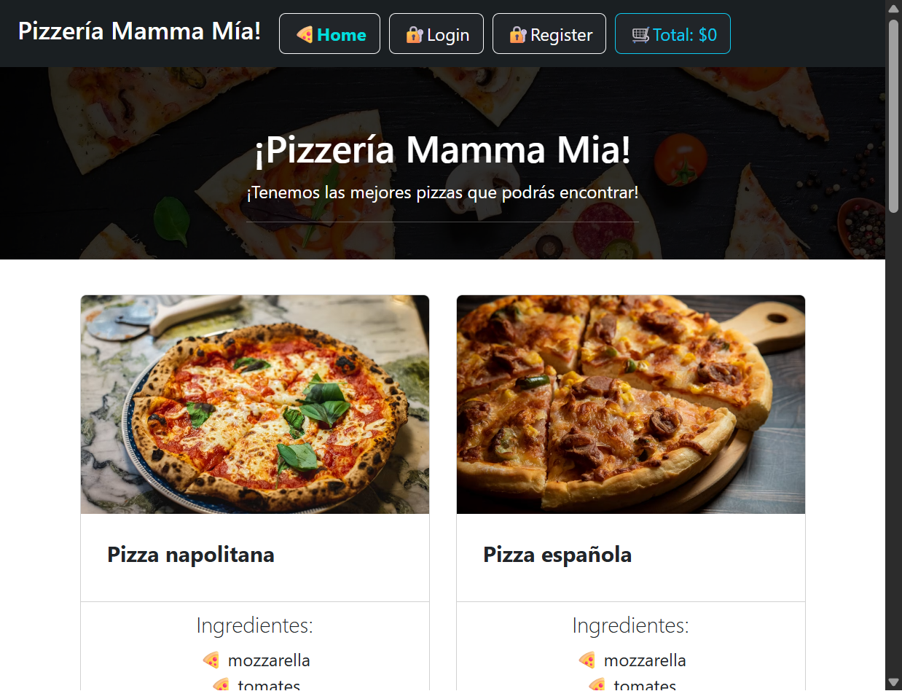
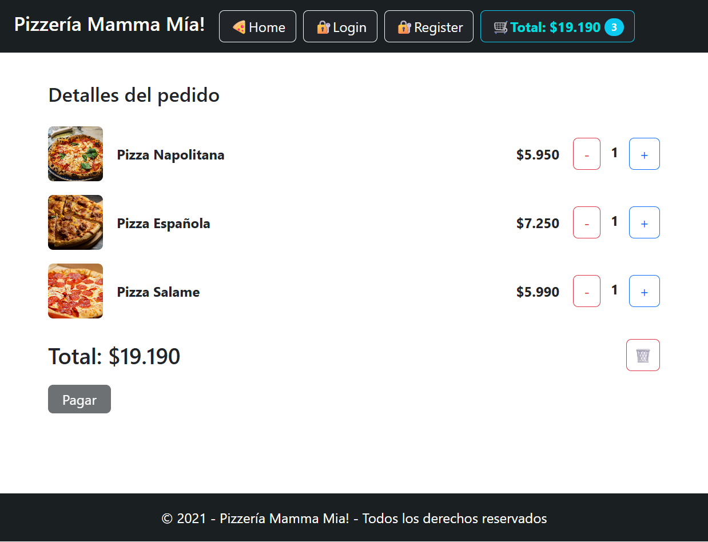
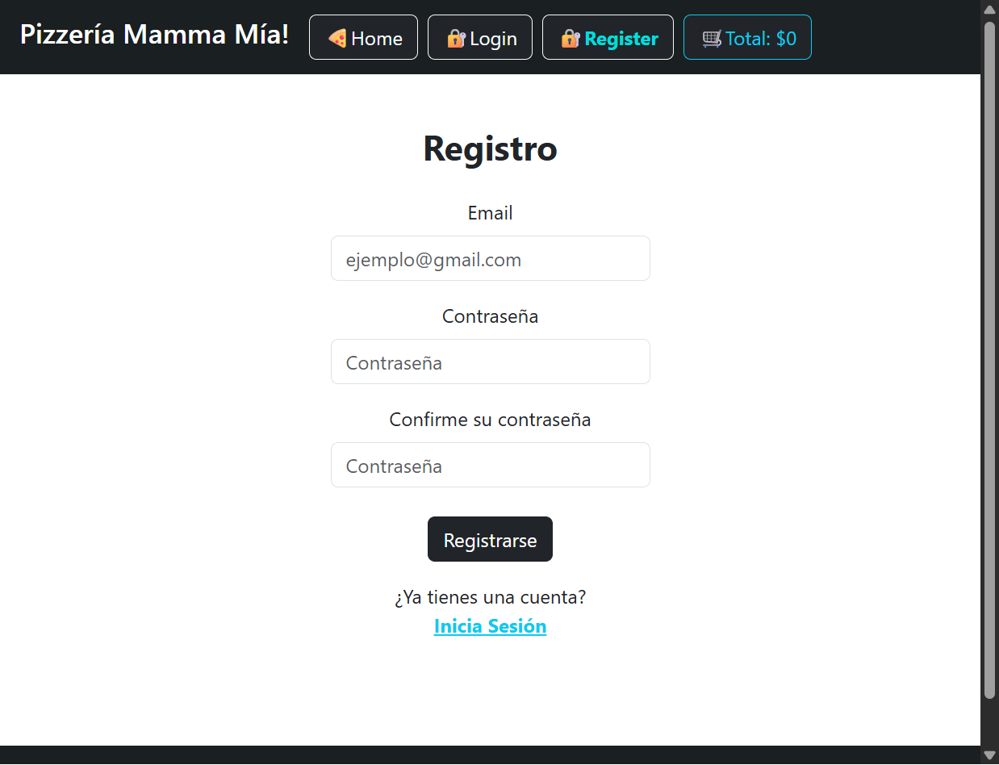

# Desafío Pizzería Mamma Mía - Carlos Macías Sandoval

Página web E-Commerce de una pizzería con sistema de carrito y manejo de sesión de usuario.

## Demo de la página web
[> Haz click aquí para visitar la web <](https://cmssandoval.github.io/desafio-pizzeria-mamma-mia/)

## Preview

## Características 
* **Home Page:** Página principal que muestra los productos y permite agregarlos directamente al carrito y ver una descripción ampliada del producto.
* **Manejo de Carrito:** Carrito de compras con gestión de cada item y posibilidad de eliminar todos los items con un botón.
* **Manejo de Usuarios:** Sesiones de usuario con persistencia. Páginas de registro e inicio de sesión.

## Tecnologías usadas
* [Bootstrap](https://getbootstrap.com/)
* [React Bootstrap](https://react-bootstrap.netlify.app/)
* [Vite](Enlace)
* [React](https://react.dev/)

